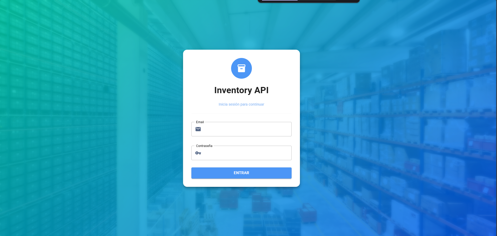
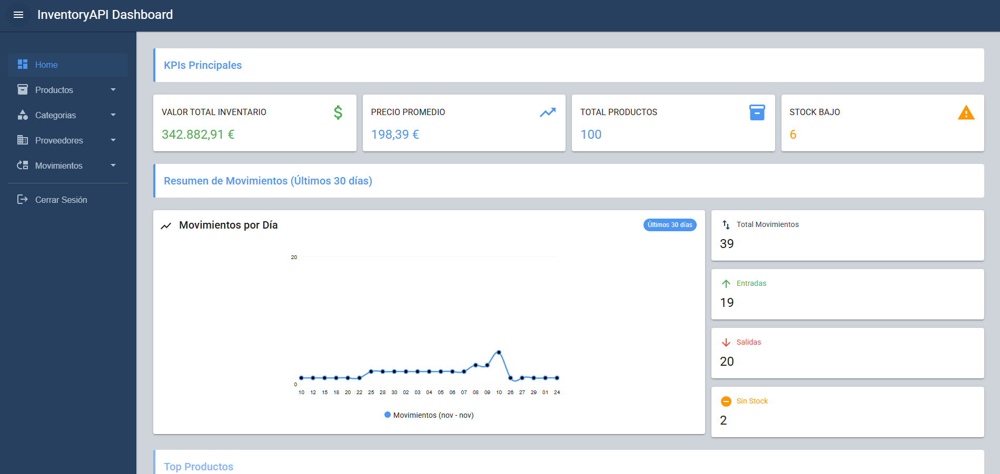
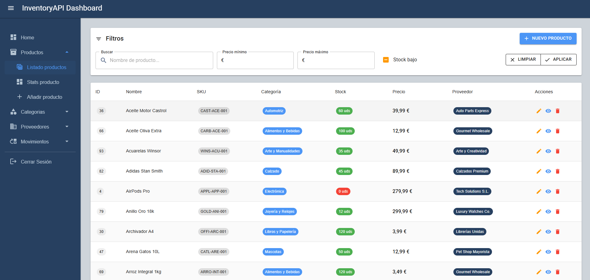
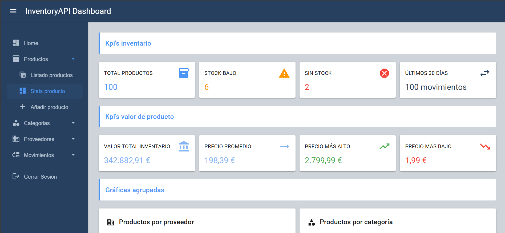
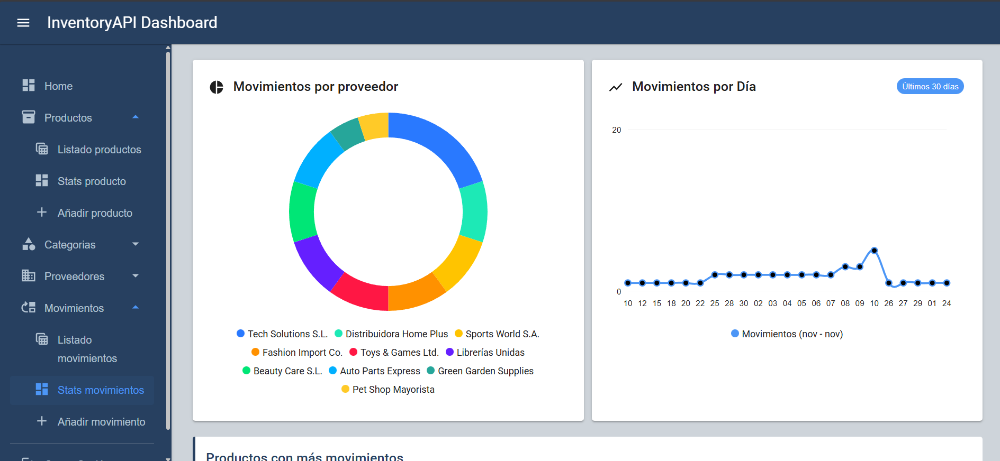
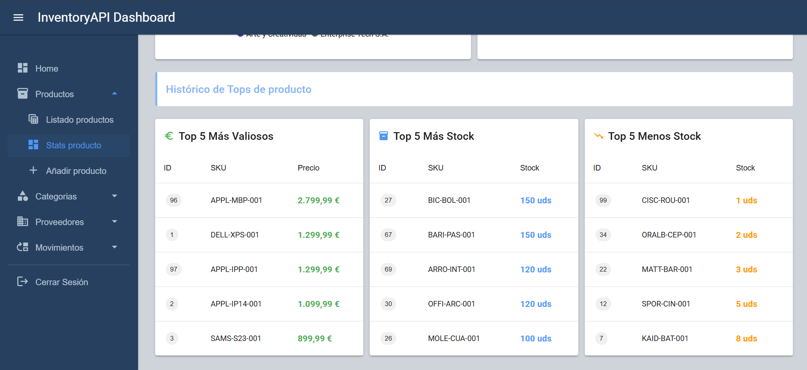
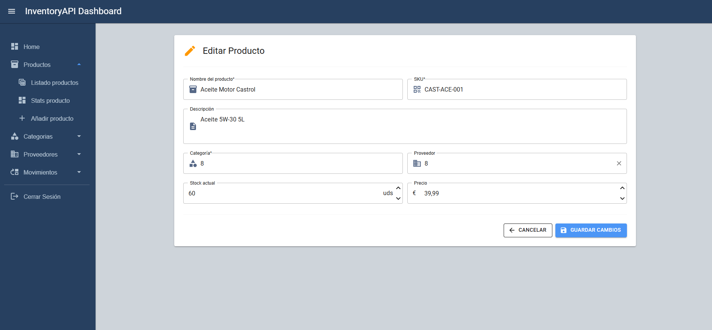
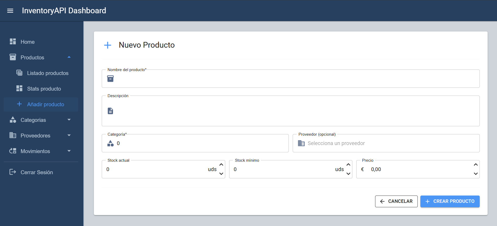

# 🎨 Inventory API - Sistema de gestión de inventarios versión WEB - Frontend


## 📖 Descripción
Sistema de gestión de inventario profesional desarrollado con **Blazor WebAssembly** y **MudBlazor**. Interfaz moderna y responsive que consume una API REST con arquitectura CQRS.

> 🔗 **Demo en vivo:** [https://inventoryfront.adriancc.com](https://inventoryfront.adriancc.com)  
> 🔗 **Backend API:** [InventoryAPI-CQRS](https://github.com/Kvr0th3c4t/InventoryAPI-CQRS-main)

---
## 📸 Capturas de pantalla

##Login


##Página principal


##Listado con filtros y paginación


##Kpi's de entiad


##Gráficas de entidad


##Tops de entidad


##Formularios de edición


##Formularios de creación


##Vista detalle de productos


## 🚀 Demo en Vivo

### 🔐 Credenciales de Prueba
```
📧 Email: demo@inventory.com
🔑 Contraseña: Demo1234!
```

**Base de datos pre-poblada con:**
- 20 categorías de productos
- 20 proveedores activos
- 100 productos de ejemplo
- Movimientos de stock (entradas, salidas, ajustes, devoluciones)
- Productos con alertas de stock crítico

---

## ✨ Características

### 📦 Gestión de Inventario
- ✅ **CRUD Completo de Entidades** - Crear, editar y eliminar productos
- ✅ **Gestión de Movimientos** - Registro de movimientos de stock (solo creación y modificación)
- ✅ **Integridad Referencial Automática** - Eliminación en cascada (ej: eliminar producto elimina sus movimientos)
- ✅ **Búsqueda y Filtros** - Búsqueda server-side en productos y movimientos
- ✅ **Paginación Optimizada** - Paginación server-side en todos los listados

### 📊 Dashboard y Estadísticas
- 📈 **KPIs por Entidad** - Métricas principales de productos, categorías, proveedores y movimientos
- 📊 **Páginas de Estadísticas** - Visualización gráfica para cada entidad
- 🎯 **Componentes Reutilizables** - KpiCard y TitleCard para dashboards

### 🔐 Autenticación y Seguridad
- 🔒 **JWT Authentication** - Login seguro con tokens Bearer
- 💾 **SessionStorage** - Tokens almacenados de forma segura (se limpian al cerrar el navegador)
- 🛡️ **Rutas Protegidas** - Control de acceso mediante atributo `[AuthorizeAttribute]`
- 🔄 **Auto-Redirección** - Redirección automática a login si no está autenticado

### 🎨 Interfaz de Usuario
- 🎭 **Login Moderno** - Página de acceso con gradiente turquesa-azul personalizado
- 📱 **Diseño Responsive** - Optimizado para móvil, tablet y desktop
- 🎯 **Navegación Intuitiva** - Menú lateral con iconos Material Design
- 🍞 **Notificaciones Snackbar** - Feedback visual de todas las acciones
- 🎨 **MudBlazor UI** - Componentes Material Design

---

## 🛠️ Stack Tecnológico

| Tecnología | Versión | Uso |
|------------|---------|-----|
| **.NET** | 9.0 | Framework base |
| **Blazor WebAssembly** | 9.0 | Single Page Application |
| **C#** | 12.0 | Lenguaje de programación |
| **MudBlazor** | 8.x | Componentes UI Material Design |
| **Refit** | 8.x | Cliente HTTP tipado REST |
| **Blazored.SessionStorage** | 2.x | Gestión de sesión |

---

## 📂 Estructura del Proyecto
```
InventoryAPI-UI/
├── 📄 Program.cs                       # Configuración de servicios, DI y Refit
├── 📄 App.razor                        # Componente raíz con routing y auth
├── 📄 _Imports.razor                   # Imports globales de namespaces
│
├── 📁 Pages/                           # Páginas de la aplicación
│   ├── 📄 Home.razor                   # Dashboard principal
│   │
│   ├── 🔐 Auth/
│   │   ├── Login.razor                # Login con gradiente personalizado
│   │   ├── LogOut.razor               # Cierre de sesión
│   │   └── RedirectToLogin.razor      # Componente de redirección
│   │
│   ├── 📦 Productos/
│   │   ├── ProductosHome.razor        # Dashboard con KPIs y estadísticas
│   │   ├── ProductosLista.razor       # Listado con filtros y paginación
│   │   ├── ProductoCrear.razor        # Formulario de creación
│   │   ├── ProductoEditar.razor       # Formulario de edición
│   │   └── ProductoDetalle.razor      # Vista detallada del producto
│   │
│   ├── 🏷️ Categorias/
│   │   ├── CategoriasHome.razor       # Dashboard de categorías
│   │   ├── CategoriasLista.razor      # Listado con paginación
│   │   ├── CategoriaCrear.razor       # Formulario de creación
│   │   └── CategoriasEditar.razor     # Formulario de edición
│   │
│   ├── 🏢 Proveedores/
│   │   ├── ProveedoresHome.razor      # Dashboard de proveedores
│   │   ├── ProveedoresLista.razor     # Listado con paginación
│   │   ├── ProveedorCrear.razor       # Formulario de creación
│   │   └── ProveedorEditar.razor      # Formulario de edición
│   │
│   └── 📊 Movimientos/
│       ├── MovimientosHome.razor      # Dashboard de movimientos
│       ├── MovimientosLista.razor     # Listado con filtros y paginación
│       └── MovimientosCrear.razor     # Formulario de creación
│
├── 📁 Components/                      # Componentes reutilizables
│   └── Dashboard/
│       ├── KpiCard.razor              # Tarjeta de KPI reutilizable
│       └── TitleCard.razor            # Tarjeta de título para secciones
│
├── 📁 Layout/                          # Layouts de la aplicación
│   ├── MainLayout.razor               # Layout principal con menú
│   └── EmptyLayout.razor              # Layout vacío para login
│
├── 📁 Services/                        # Servicios de negocio
│   ├── Auth/
│   │   ├── IAuthService.cs           # Interface Refit para autenticación
│   │   ├── CustomAuthStateProvider.cs # Proveedor de estado de auth
│   │   └── AuthHeaderDansdler.cs     # Interceptor para agregar JWT
│   │
│   ├── ProductoService/
│   │   ├── IProductoService.cs       # Interface de servicio
│   │   └── ProductoService.cs        # Implementación con lógica
│   │
│   ├── CategoriaService/
│   ├── ProveedorService/
│   ├── MovimientoService/
│   │
│   └── StatsService/                  # Servicios de estadísticas
│       ├── ProductoStatsService/
│       ├── CategoriaStatsService/
│       ├── ProveedorStatsService/
│       └── MovimientoStatsService/
│
├── 📁 Interfaces/                      # Interfaces Refit (API clients)
│   ├── IProducto.cs                   # Endpoints de productos
│   ├── ICategoria.cs                  # Endpoints de categorías
│   ├── IProveedor.cs                  # Endpoints de proveedores
│   ├── IMovimiento.cs                 # Endpoints de movimientos
│   │
│   └── Stats/                         # Interfaces de estadísticas
│       ├── IProductoStats.cs
│       ├── ICategoriaStats.cs
│       ├── IProveedorStats.cs
│       └── IMovimientosStats.cs
│
├── 📁 Models/                          # DTOs y modelos
│   ├── Auth/
│   │   ├── LoginDto.cs
│   │   ├── LoginResponseDto.cs
│   │   └── RegisterDto.cs
│   │
│   ├── ProductoModel/
│   │   ├── ProductoResponseDto.cs
│   │   ├── CreateProductoDto.cs
│   │   └── UpdateProductoDto.cs
│   │
│   ├── CategoriaModel/
│   │   ├── CategoriaResponseDto.cs
│   │   ├── CreateCategoriaDto.cs
│   │   └── UpdateCategoriaDto.cs
│   │
│   ├── ProveedorModel/
│   │   ├── ProveedorResponseDto.cs
│   │   ├── CreateProveedorDto.cs
│   │   └── UpdateProveedorDto.cs
│   │
│   ├── MovimientoModel/
│   │   ├── MovimientoResponseDto.cs
│   │   ├── CreateMovimientoStockDto.cs
│   │   └── UpdateMovimientoDto.cs
│   │
│   ├── Pagination/
│   │   └── PagedResponse.cs          # Modelo genérico de paginación
│   │
│   └── StatsModels/                   # Modelos de estadísticas
│       ├── ProductosStatsModel/
│       │   ├── DistribucionCategoriaDto.cs
│       │   └── DistribucionProveedorDto.cs
│       │
│       ├── MovimientosStatsModel/
│       │   ├── EntradaVsSalidaDto.cs
│       │   ├── MovimientoPorDiaDto.cs
│       │   ├── MovimientoPorProveedorDto.cs
│       │   ├── ProductoMasMovidoDto.cs
│       │   └── TipoMovimientoDto.cs
│       │
│       └── ProveedoresStatsDto/
│           └── DistribucionValorProveedorDto.cs
│
├── 📁 Enums/
│   └── TipoMovimiento.cs              # Enum para tipos de movimiento
│
├── 📁 Shared/
│   └── AppTheme.cs                    # Configuración de tema MudBlazor
│
└── 📁 wwwroot/
    ├── index.html                     # HTML base
    ├── appsettings.json               # Config desarrollo
    └── appsettings.Production.json    # Config producción (gitignored)
```

---

## 🚀 Instalación y Configuración Local

### Prerrequisitos

- ✅ [.NET 9 SDK](https://dotnet.microsoft.com/download/dotnet/9.0)
- ✅ Backend API corriendo ([InventoryAPI-CQRS](https://github.com/Kvr0th3c4t/InventoryAPI-CQRS-main))

- ¡¡ACTUALMENTE LOS TESTS NO FUNCIONAN EN EL PROYECTO DE InventoryAPI-CQRS-main!!

### Clonar e Instalar
```bash
# Clonar repositorio
git clone https://github.com/Kvr0th3c4t/InventoryAPI-Front.git
cd InventoryAPI-Front

# Restaurar dependencias
dotnet restore

# Configurar endpoint de la API
# Editar wwwroot/appsettings.json
{
  "BaseAPI": "https://localhost:7000/"  # Tu API local
}

# Ejecutar
dotnet run

# O con hot reload
dotnet watch
```

Abrir navegador en: `https://localhost:7002`

---

## 🏗️ Arquitectura y Patrones

### Patrón de Servicios en Capas
```
┌─────────────────────────────────────────┐
│         Pages (Razor Components)        │  ← Componentes UI
├─────────────────────────────────────────┤
│      Services (Business Logic)         │  ← Lógica de negocio
├─────────────────────────────────────────┤
│    Interfaces (Refit API Clients)      │  ← Comunicación HTTP
├─────────────────────────────────────────┤
│          Backend API (CQRS)             │  ← API REST
└─────────────────────────────────────────┘
```

### Flujo de Datos

1. **Componente** llama a un `Service`
2. **Service** usa una `Interface` de Refit
3. **Refit** genera el cliente HTTP y llama a la API
4. **AuthHeaderHandler** intercepta y agrega el token JWT
5. API procesa y devuelve datos
6. Datos fluyen de vuelta al componente

---

## 🔐 Autenticación JWT

### Componentes de Seguridad

#### 1. **CustomAuthStateProvider**
Gestiona el estado global de autenticación leyendo el token de SessionStorage.

#### 2. **AuthHeaderHandler**
Interceptor que agrega automáticamente `Authorization: Bearer {token}` a todas las peticiones HTTP.

#### 3. **Rutas Protegidas**
```razor
@page "/productos"
@attribute [AuthorizeAttribute]
```

### Flujo de Login
```
1. Usuario ingresa email y password
2. POST /api/Auth/login
3. API valida credenciales
4. API devuelve JWT token
5. Token se guarda en SessionStorage
6. AuthStateProvider notifica cambio de estado
7. Usuario redirigido al dashboard
```

---

## 📊 Funcionalidades por Entidad

### Productos
- ✅ Dashboard con KPIs (total, stock bajo, sin stock, valor total)
- ✅ Estadísticas de distribución por categoría y proveedor
- ✅ Listado con búsqueda y filtros server-side
- ✅ Paginación optimizada
- ✅ CRUD completo (Crear, Editar, Eliminar, Detalle)
- ✅ Eliminación en cascada (elimina movimientos asociados)

### Categorías
- ✅ Dashboard con KPIs
- ✅ Listado paginado
- ✅ CRUD completo
- ✅ Estadísticas de productos por categoría

### Proveedores
- ✅ Dashboard con KPIs
- ✅ Listado paginado
- ✅ CRUD completo
- ✅ Estadísticas de distribución de valor

### Movimientos de Stock
- ✅ Dashboard con KPIs y gráficas
- ✅ Listado con filtros y paginación
- ✅ Solo creación y modificación (no eliminación)
- ✅ Tipos: Entrada (0), Salida (1), AjustePositivo (2), AjusteNegativo (3)
- ✅ Estadísticas: Entradas vs Salidas, por día, por proveedor, productos más movidos

---

## 🔗 Repositorios Relacionados

- 🔙 **Backend API (CQRS):** [InventoryAPI-CQRS](https://github.com/Kvr0th3c4t/InventoryAPI-CQRS-main)

---

## 👤 Autor

**Adrián Carmona Caballero**

- 🌐 Portfolio: [https://adriancc.com](https://adriancc.com)
- 💼 GitHub: [@Kvr0th3c4t](https://github.com/Kvr0th3c4t)
- 💼 Linkedin : [@AdrianCarmonaCaballero](https://www.linkedin.com/in/adrian-carmonamad/)

---

## 📄 Licencia

Este proyecto es de código abierto bajo la licencia MIT.

---
## Todos los consejos para mejorar son bienvenidos!!
## Si vas a utilizar este proyecto, no olvides referenciar al autor original!!
## ⭐ Si te gustó este proyecto, dale una estrella en GitHub!
